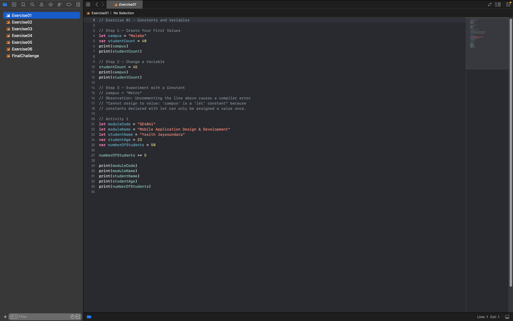
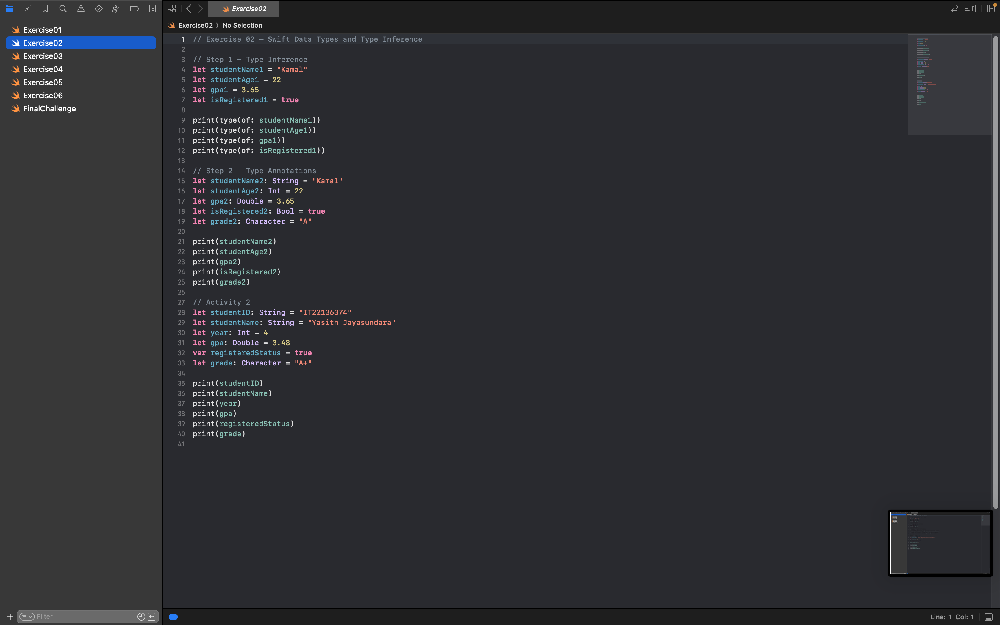
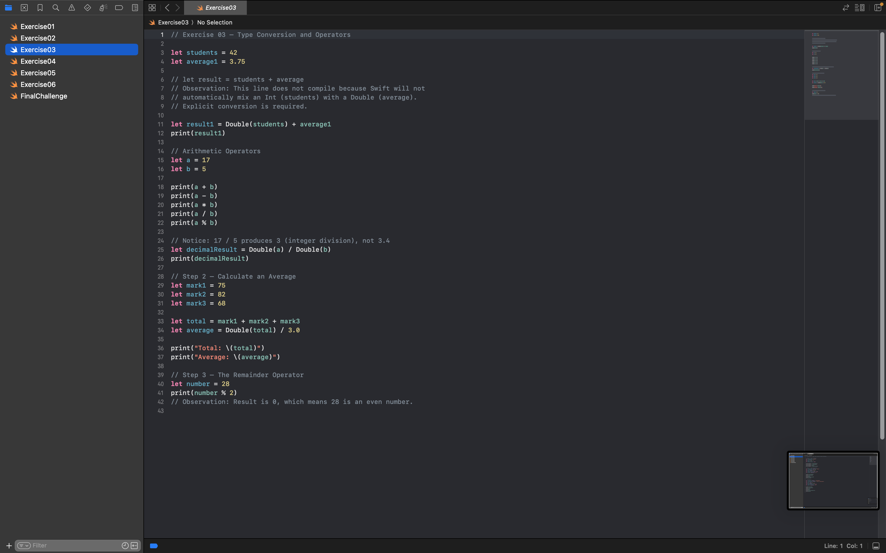
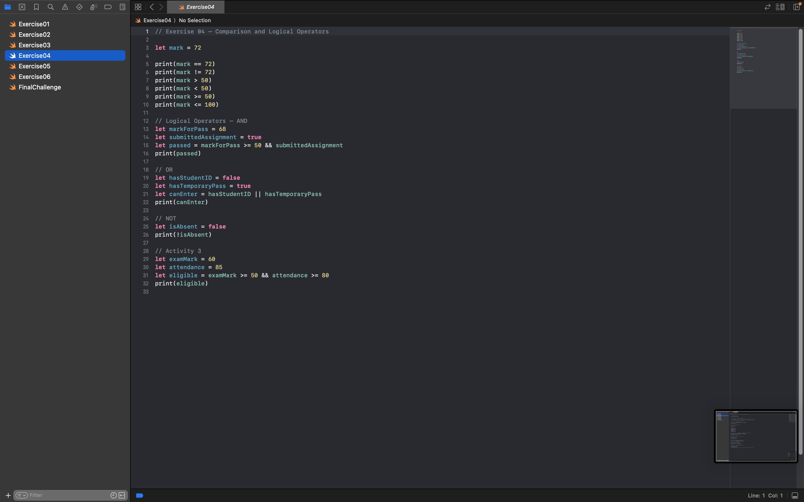
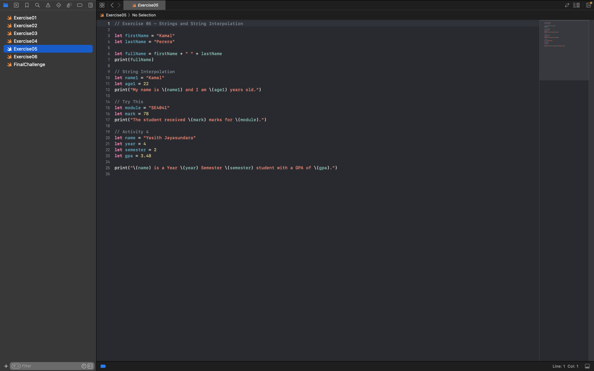
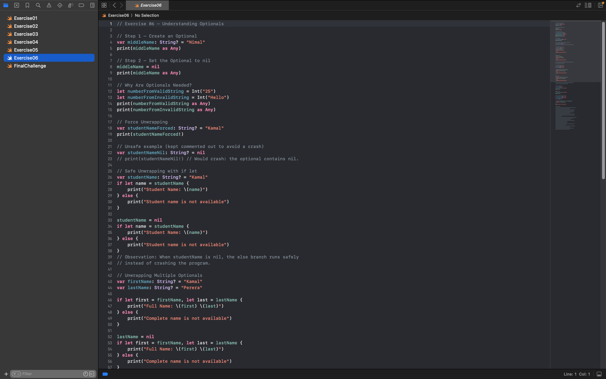

# SE4041 – Practical 01 – Swift Fundamentals

- **Student Name:** Jayasundara R.K.M.J.Y
- **Student ID:** IT22136374
- **Environment Used:** Xcode Playground

---

## My Practical Evidence

### 1. Exercise 01

### 2. Exercise 02

### 3. Exercise 03

### 4. Exercise 04

### 5. Exercise 05

### 6. Exercise 06

### 7. Final Challenge

